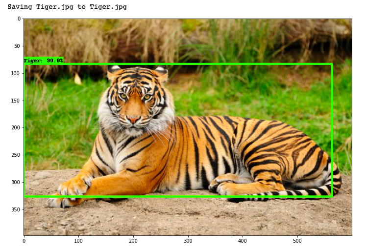

# [Tensorflow-Obj-Det-API-Projects](https://github.com/tensorflow/models/tree/master/research/object_detection)

This Project folder is dedicated to Tensorflow Object Detection API 2. 
Here I have Used :
1. **[Tensorflow Object Detection API 2](https://github.com/tensorflow/models/blob/master/research/object_detection/g3doc/tf2_detection_zoo.md)** Models Provided by Google and transfer learning approach to custom train them.
2. **Google Open Image Datasets** For downloading Training and Validation Image Datasets. Link: [Google OIDV4 toolkit](https://github.com/EscVM/OIDv4_ToolKit)

Please find the below summary of the projects that I have done:
### 1. Zoo Detector: Design a Custom Object detection Model which can detect various types of animals.
- Due to the limited availability of computing resources I can only train on 600 images of a total of 3 classes i.e.:
  - Tiger
  - Lion
  - Bear
- Training Notebook name: **tensorflow_obj_det/workspace/zoo_detector/programs/train.ipynb** 
- Please execute all the codes on google colab as the code is better suited to run on colab environment rather than on local machine.
  - After cloning this repository just copy **tensorflow_obj_det** folder into the **Colab Notebooks** in your google Drive.
  - And explore the above notebook for training the custom model i.e **tensorflow_obj_det/workspace/zoo_detector/programs/train.ipynb** 
  - Manually edit **tensorflow_obj_det/workspace/zoo_detector/data/annotations/labelmap.pbtxt** to support for your desired classes.
  - Manually edit **Download training and testing images from Google OID** code section inside train.ipynb to download your desired training and testing class images from **Google Open Image Dataset**
  - I have used **Google OIDV4** for downloading my training image Datasets.
  - Then You can run the code to train your desired model. 
  - I forgot to mention that you can also configure your desired model from [TF2_Zoo Object detection Models](https://github.com/tensorflow/models/blob/master/research/object_detection/g3doc/tf2_detection_zoo.md)
  - These are some of the collection of detection models pre-trained on the COCO 2017 dataset which has 90 classes.
  - But here we will custom train them using the transfer learning approach defined by Google Tensorflow Hub.
- **OutPut  Detections** :
  - Then you can run **tensorflow_obj_det/workspace/zoo_detector/programs/validate.ipynb** to see the results.
  - Feel free to explore custom trained Object detection models and Have fun!!
  - **Only one Tiger -**
    - 
  - **Tiger With a Lion -**
    - 
    - 
  - **Tiger with a Bear -**
    - 
  - **Lots of Bears -**
    - 
## References:
- **Readthedocs Guide:-** https://tensorflow-object-detection-api-tutorial.readthedocs.io/en/latest/index.html
- **Google Tensorflow Object Detection API-2 Home page:-** https://github.com/tensorflow/models/tree/master/research/object_detection
- **Google OIDV4 toolkit:-** (https://github.com/EscVM/OIDv4_ToolKit)
